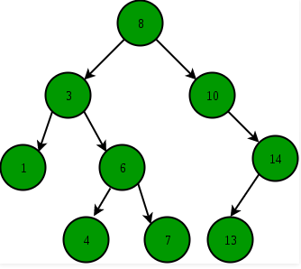

# Binary Search Tree
In computer science, a tree is a non-linear data structure in which we can express hierarchical relationships. The elements of a tree are called **nodes**, the first element is the **root node**, the root node can be linked to other nodes, we call the links as **edges** and the linked nodes as **children** of the root. In a generic tree, each node has an undefined number of children, but in a binary tree, nodes can have a maximum of two children, the left child and the right child, a node that do not have any child is called a **leaf node**. The nodes may store some data, called the **key value**, it could be an integer, a float a char or a data of another type, a good characteristic of a tree when compared to other structures is the fact that it is possible to insert or remove elements within it with a constant time complexity *O(1)*.

To make it as a **Binary Search Tree** it is necessary to implement a methodology to insert new elements inside the structure. It is chosen to place the nodes according to the values ​​stored in them, if a child has a key value that is greater than the value of its parent, this node must be placed as the right child, otherwise, as the left child.  Doing this way, it is possible to implement the binary search algorithm.

But doing this is not enough, we can have some bad inputs, for example: if the tree receives an already sorted input, the structure will become a linked list. This is our worst case scenario, as it has an O (n) time complexity for the search operation. Therefore, we must ensure that the tree maintains its structure as a binary search tree; for this, we need to implement a balance factor, which is a measure of the "quality" of the structure, it is a way of identifying when it is diverging from its original definition.

We can define the balance factor as the difference between the height of the left child and the right child. Here I set the height value as the number of edges on the longest path from the node to a leaf. When the equilibrium factor is in its absolute value greater than 1, we must correct the structure and make this verification whenever a new element is inserted or removed in order not to lead to the imbalance to be developed in the other nodes, after a correction, we also need to verify that it generated an imbalance in the nodes above.

We can correct the imbalance in a given node by the "rotations" of its subtrees. We have four different types of rotations that must be applied each in specific situations of imbalance. We have defined in the code :

* Left-Left rotation
* Left-Right rotation
* Right-Right rotation
* Right-Left rotation

You can see a quick explanation on wikipedia [Wiki](https://en.wikipedia.org/wiki/AVL_tree#Simple_rotation) and also in the function file, where I specified the right time to execute any of them. If you have a lot of curiosity and patience, this long video calmly explains each situation [Youtube](https://www.youtube.com/watch?v=TbvhGcf6UJU).

By applying the corrections, it is possible to guarantee an *O(nlogn)* time complexity in the search process, adding this feature to the *O(1)* complexity to insert and remove elements. We can see why binary search trees have become important data structures that deserve to be understood.